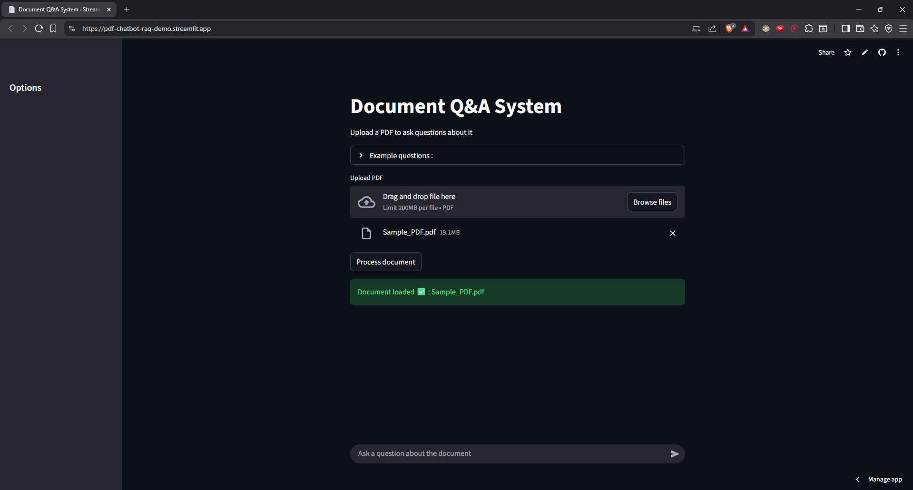

# Document Q&A System

A RAG (Retrieval-Augmented Generation) based system for answering questions about uploaded PDF documents using semantic search and LLMs.

**🚀 [Try Live Demo](https://pdf-chatbot-rag-demo.streamlit.app/)**

## Features

✅ **PDF Processing** - Upload and extract text from any PDF document  
✅ **Semantic Search** - Find relevant content using embeddings, not just keywords  
✅ **Conversation Memory** - Remembers previous questions for context-aware follow-ups  
✅ **Source Citations** - Shows which parts of the document were used to answer  
✅ **Error Handling** - Graceful failures with helpful error messages  
✅ **Clean Chat UI** - Professional interface with user/assistant message bubbles  



## How It Works

```
PDF Upload
    ↓
Text Extraction (PyPDF2)
    ↓
Smart Chunking (1500 chars, 200 overlap, sentence boundaries)
    ↓
Embeddings (sentence-transformers)
    ↓
Vector Storage (FAISS)
    ↓
User Question → Semantic Search → Retrieve Top 3 Chunks
    ↓
LLM Generation (Groq) + Conversation History
    ↓
Answer + Source Citations
```

## Tech Stack

**Backend:**  
- Python 3.10+
- PyPDF2 (PDF text extraction)
- sentence-transformers (text embeddings)
- FAISS (vector similarity search)
- Groq API (LLM inference)

**Frontend:**  
- Streamlit (UI framework)
- Streamlit Cloud (deployment)

**Key Libraries:**  
`streamlit` • `sentence-transformers` • `faiss-cpu` • `groq` • `PyPDF2` • `python-dotenv`

## Performance

| Metric              | Value                 |
| ------------------- | --------------------- |
| Processing Time     | 30-60 seconds (CPU)   |
| Query Response Time | < 2 seconds           |
| Max Document Size   | ~200 pages            |
| Embedding Speed     | ~50 chunks/minute     |
| Deployment          | Free (Streamlit Cloud)|

## Usage Example

1. **Upload a PDF**
   - Click "Browse files" or drag & drop
   - Click "Process document" (30-60 seconds)

2. **Ask Questions**
   ```
   You: "What is this document about?"
   Bot: "This document discusses..."
   
   You: "Can you elaborate?"  ← Remembers context!
   Bot: "Sure, the document covers..."
   ```

3. **View Sources**
   - Click "View Sources" to see which chunks were used
   - Verify answer accuracy

4. **Clear Conversation**
   - Click "Clear conversations" in sidebar
   - Start fresh while keeping document loaded

---

**Built as part of learning RAG systems and production ML engineering!** 🚀
