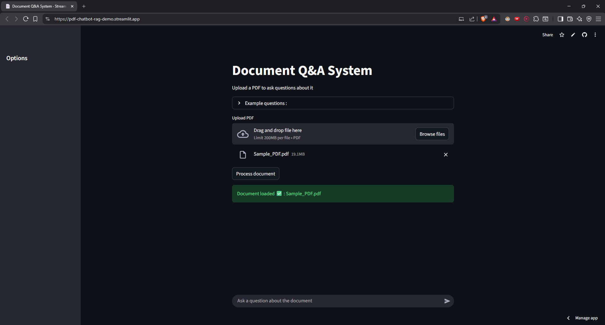

# Document Q&A System 🤖

A production-grade RAG (Retrieval-Augmented Generation) system with modular architecture for answering questions about PDF documents using semantic search and LLMs.

**🚀 [Try Live Demo](https://pdf-chatbot-rag-demo.streamlit.app/)**

## 🎯 What It Does

Upload any PDF document and ask questions about it in natural language. The system uses semantic search to find relevant context and generates accurate answers with source citations.

**Example:**
```
User: "What is the attention mechanism?"
System: Searches 50 chunks → Finds top 3 relevant sections
System: Generates answer using those sections
System: Shows sources used for verification
```

---

## ✨ Features

✅ **PDF Processing** - Extract and process text from any PDF document  
✅ **Smart Chunking** - Sentence-boundary aware splitting (1000 chars, 200 overlap)  
✅ **Semantic Search** - FAISS vector search with 384-dimensional embeddings  
✅ **Conversation Memory** - Context-aware follow-up questions  
✅ **Source Citations** - View exact chunks used for each answer  
✅ **Modular Architecture** - Production-grade code with single-responsibility modules  



---

## 🏗️ Architecture Overview

The system is built with 6 independent modules, each with a single responsibility:

- Config (config.py) – Centralized configuration and environment settings
- Document Processor (document_processor.py) – PDF extraction and text cleaning
- Chunking (chunking.py) – Intelligent text splitting for downstream processing
- Embedding Manager (embedding_manager.py) – Converts text into vector embeddings
- Vector Store (vector_store.py) – Manages FAISS index creation and queries
- Retriever (retriever.py) – Orchestrates semantic search and retrieval
- LLM Service (llm_service.py) – Handles LLM API integration and prompting
- QA System (qa_system.py) – Main orchestrator coordinating the end-to-end flow

---

### **Data Flow**
```
PDF Upload
    ↓
📄 Document Processor (PyPDF2)
    ↓
✂️ Text Chunker (sentence boundaries)
    ↓
🧠 Embedding Manager (sentence-transformers)
    ↓
💾 Vector Store (FAISS IndexFlatL2)
    ↓
🔍 User Question → Retriever → Top-K Chunks
    ↓
🤖 LLM Service (Groq API) + Context
    ↓
✅ Answer + Source Citations
```

---

## 🛠️ Tech Stack

- Python
- Streamlit 
- FAISS
- sentence-transformers 
- Groq API
- LLaMA 3.3 70B 
- PyPDF2 
- NumPy

---

## 📊 Performance

| Metric                 | Value                        |
| ---------------------- | ---------------------------- |
| Processing Time        | ~30-60 seconds (CPU)         |
| Query Response Time    | < 2 seconds                  |
| Embedding Dimension    | 384 (MiniLM-L3-v2)           |
| Search Algorithm       | FAISS IndexFlatL2 (exact)    |
| Chunks per Document    | ~40-60 (1000 char chunks)    |
| Max Document Size      | ~200 pages                   |
| Deployment             | Streamlit Cloud (free tier)  |

---

## 🔍 How It Works

### **1. Document Processing**
```python
# Extract text from PDF
text = document_processor.load_pdf("document.pdf")

# Smart chunking with sentence boundaries
chunks = chunker.chunk_text(text, chunk_size=1000, overlap=200)
```

### **2. Semantic Search**
```python
# Convert chunks to 384-dim embeddings
embeddings = embedding_manager.encode_batch(chunks)

# Store in FAISS index (L2 distance)
vector_store.add_vectors(embeddings, chunks)

# Search for similar chunks
query_embedding = embedding_manager.encode_text("What is...")
distances, indices = vector_store.search(query_embedding, k=3)
```

### **3. Answer Generation**
```python
# Retrieve relevant context
relevant_chunks = retriever.retrieve(question, k=3)

# Generate answer with LLM
answer = llm_service.generate_answer(
    question=question,
    context_chunks=relevant_chunks,
    chat_history=previous_messages
)
```

---

## 🔮 Future Enhancements

Potential improvements for V3:

- [ ] **Hybrid Search** - Combine vector search with keyword search
- [ ] **Reranking** - Use cross-encoder to rerank retrieved chunks
- [ ] **Better Chunking** - Semantic chunking (split on topic changes)
- [ ] **Evaluation Metrics** - Measure retrieval precision/recall
- [ ] **API Endpoint** - FastAPI for programmatic access
- [ ] **Multi-Document** - Query across multiple PDFs
- [ ] **Caching** - Don't re-embed same documents

---

**Built as part of my AI/ML engineering journey** 🚀  
